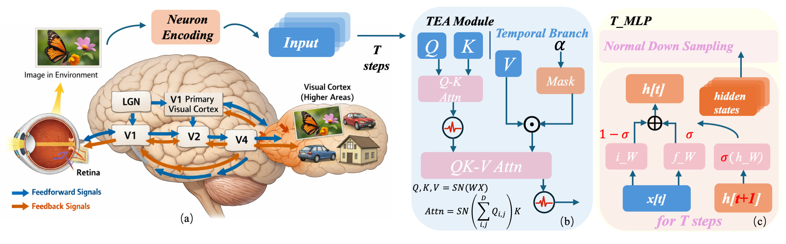

# TEFormer: Structured Bidirectional Temporal Enhancement Modeling in Spiking Transformers



## Reference

Here is the official implemented code of TEFormer which is the **1st** brain-inspired bidirectional temporal enhancement Spiking Transformer. The code is based on [STEP](https://github.com/Fancyssc/STEP) and [Braincog](https://github.com/BrainCog-X/Brain-Cog)

## Requirements
### STEP Environment
```
git clone https://github.com/Fancyssc/STEP.git
```
### Dataset Preparation
**Datasets Needed**: CIFAR10-DVS, N-CALTECH101, UCF101DVS, NCARS, HMDB51DVS, CIFAR10/100, SVHN

### Training on CIFAR10/100/SVHN
```
python train.py --config configs/your_config_file.yml
```
### Training on Neuromorphic Datsaets
```
python train_dvs.py --config configs/your_config_file.yml
```

### Selected Experiments Results 
#### Result On CIFAR10/100
| Model       | Architecture      | Step   | SNN   | CIFAR10   | CIFAR100   |
|-------------|-------------------|--------|-------|-----------|------------|
| ResNet-19   | ResNet            | 1      | ✗     | 94.97     | 75.35      |
| PLIF        | ConvNet           | 8      | ✗     | 93.50     | 74.80      |
| tdBN        | ResNet            | 4      | ✓     | 92.92     | -          |
| DIET-SNN    | VGGNet            | 5      | ✓     | 92.70     | 69.67      |
| DSR         | ResNet            | 20     | ✓     | 95.40     | 78.50      |
| SNASNet     | ConvNet           | 5      | ✓     | 93.64     | 73.04      |
| | | || |            |
| ViT         | ViT               | 1      | ✗     | 90.89     | -          |
| Spikingformer | Spikingformer     | 4      | ✓     | 95.53     | 79.12      |
| Spikformer+SEMM | Spikformer        | 4      | ✓     | 94.98     | 77.59      |
| Spiking Wavelet | SWFormer          | 4      | ✓     | 95.31     | 76.99      |
| | | || |            |
| Spikformer  | Spikformer        | 4      | ✓     | 95.09     | 77.72      |
| SDT         | SD-Transformer    | 4      | ✓     | 95.78     | 78.64      |
| QKFormer    | H-Spikformer      | 4      | ✓     | 95.91     | 79.09      |
| TIM         | Spikformer        | 4      | ✓     | 94.20     | 75.04      |
| | | || |            |
| **TEFormer (ours)** | H-Spikformer      | 4      | ✓     | **96.24** | **79.84**  |


#### Results on Neuromorphic Datasets
| Dataset         | Model              | Size  | Acc@1 | Step | Batch-Size |
|-----------------|--------------------|-------|-------|------|------------|
| CIFAR10-DVS     | Spikformer         | 2-256 | 80.25 | 10   | 32         |
| CIFAR10-DVS     | QKFormer           | 2-256 | 79.30 | 10   | 32         |
| CIFAR10-DVS     | TIM                | 2-256 | 80.85 | 10   | 32         |
| CIFAR10-DVS     | **TEFormer (ours)**| 2-256 | **81.90** | 10 | 32     |
| | | || |            |
| N-CALTECH101    | Spikformer         | 2-256 | 77.93 | 10   | 16         |
| N-CALTECH101    | QKFormer           | 2-256 | 76.09 | 10   | 16         |
| | | || |            |
| N-CALTECH101    | Spikformer         | 4-384 | 73.33 | 16   | 16         |
| N-CALTECH101    | QKFormer           | 4-384 | 76.09 | 16   | 16         |
| N-CALTECH101    | **TEFormer (ours)**| 4-384 | **78.05** | 16 | 16     |
| | | || |            |
| NCARS           | Spikformer         | 2-256 | 95.60 | 16   | 32         |
| NCARS           | QKFormer           | 2-256 | 95.29 | 16   | 32         |
| NCARS           | **TEFormer (ours)**| 2-256 | **95.95** | 16 | 32     |

#### Result On Neuron Encoding Schemas
| Model              | Direct | Phase | Rate  | TTFS |
|--------------------|--------|-------|-------|------|
| Spikformer         | 95.09  | 82.63 | 82.68 | 81.87 |
| SDT                | 95.78  | 85.33 | 84.06 | 84.52 |
| QKFormer           | 95.91  | 87.76 | 83.77 | 84.69 |
| TIM                | 94.20  | 81.43 | 81.48 | 80.66 |
| **TEFormer (ours)**| **96.24** | **89.92** | **84.74** | **87.46** |